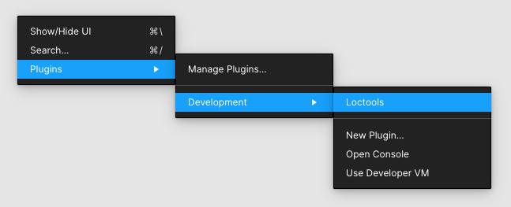
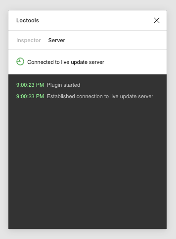
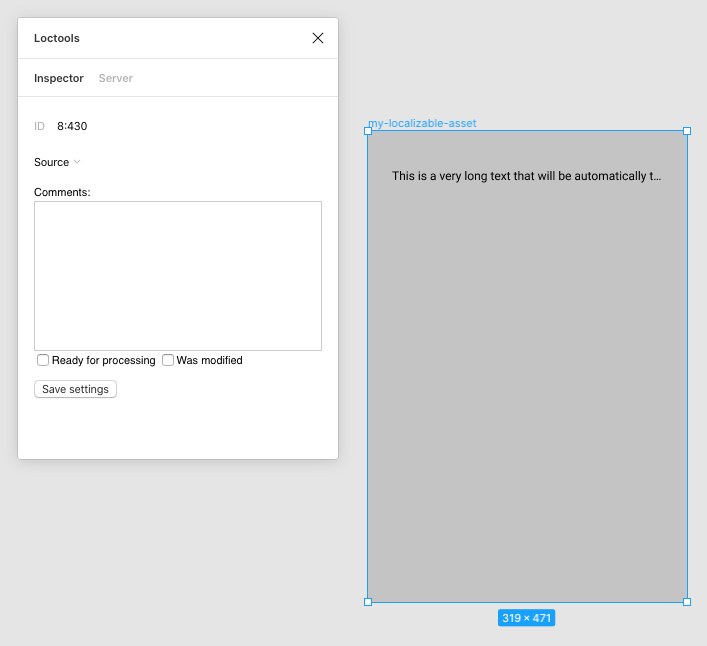
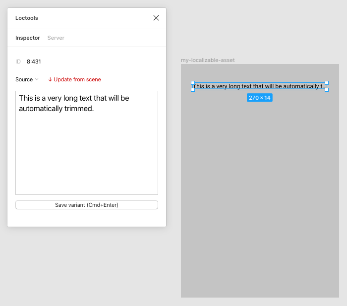

# Figma Plugin Overview

## Installing and Running the Plugin

1. [Have your Figma plugin installed](https://help.figma.com/hc/en-us/articles/360042786733-Register-a-Plugin-for-development) in your local instance of Figma application. The plugin will register itself under **Loctools** name.
2. Compile and run the Figma plugin server on the same computer Figma is running.
3. Open or create a Figma file you plan to have localized (see below an overview on making your designs localizable).
4. [Start the plugin](https://help.figma.com/hc/en-us/articles/360042532714-Use-Plugins-in-the-Editor):
   

    The plugin will automatically connect to its local server counterpart, and clicking on a _Server_ tab will give the following picture:

    

## Preparing Figma File for Localization

### File/Folder Structure

The structure of the document (file) in Figma is mapped to a folder/file structure of final assets and localization files. Here is how the mapping is performed:

1. Figma file name becomes the top-level folder. When constructing file paths, the name is lowercased, and spaces are placed with dashes, i.e. "For Localization" file name becomes a top-level "for-localization" folder.
2. A Figma file can contain multiple pages; pages become subdirectories. One can use forward slash to create subdirectories. I.e. "Marketing/Mobile" page name would create a "marketing" directory with "mobile" subdirectory inside.
3. Every top-level frame becomes a potentially exportable asset. In Figma, you can see names displayed above each asset. As with page names, one can use forward slashes to create nested subfolders in the output asset structure.
4. Figma file name + page name + asset name is what defines the final path to the asset files.

Assume the following Figma file structure:

```
For Localization                   (Figma file name)
    mobile/iOS/iPhone              (page name)
        appstore/feature-one	   (asset name)
        appstore/feature-two       (asset name)
```

The generated localization folder and file structure will be:

```
/for-localization
    /mobile
        /ios
            /iphone
    			/appstore
                    /feature-one
                        de.json
                        ru.json
                        src.json
                        ...
                    /feature-two
                        de.json
                        ru.json
                        src.json
                        ...
```

The resulting asset folder and file structure will be:

```
/for-localization
    /mobile
        /ios
            /iphone
    			/appstore
                    /feature-one
                        de.png
                        de@2x.png
                        ru.png
                        ru@2x.png
                        src.png
                        src@2x.png
                        ...
                    /feature-two
                        de.png
                        de@2x.png
                        ru.png
                        ru@2x.png
                        src.png
                        src@2x.png
                        ...
```

### Design Considerations

1. Design with localization in mind; ensure there's a room for longer captions. For larger blocks of text, assume that translations are 1.4 times longer on average, but on smaller text labels translations can be even 2 or 3 times longer.
2. For text that needs to stay within certain dimensions and that allows for clipping using ellipsis (...), wrap each text node into a frame and set text node's property to auto-width (for one-line labels) or auto-height (for multi-line text).
3. For elements that need to resize dynamically when text changes, use the Auto Layout feature in Figma.

## Inspecting object properties

Inspector tab of the plugin allows one to see the properties of exportable frames (assets) and text objects.

Selecting a top-level frame on any page will show its properties:



-   **Source**: Once the selected asset has more than one variants (languages), use this drop-down to select a variant and switch the entire asset to that variant.
-   **Comments**: Place any arbitrary comment that will be exported with the localization JSON file.
-   **Ready for processing**: Check this flag when the asset is ready for translation (by default, this flag is off). Uncheck it again to move the asset into drafts, i.e. before you start modifying the design, if you don't want your intermediate edits to be picked up automatically.
-   **Was modified**: Check this flag to force export all localization files and all final language assets. By default, Loctools plugin will try to determine whether the asset has changed and needs exporting, but in certain cases you may want to force exporting.

Selecting a text node will show its properties:



-   **Source**: Once the selected text node has more than one variants (languages), use this drop-down to select this variant and display its text in the editor below.
-   **Save variant**: Press this button to apply the text from the editor above. If a resizable text object is placed inside a fixed-sized parent frame, it will be automatically trimmed to fit the parent frame geometry.
